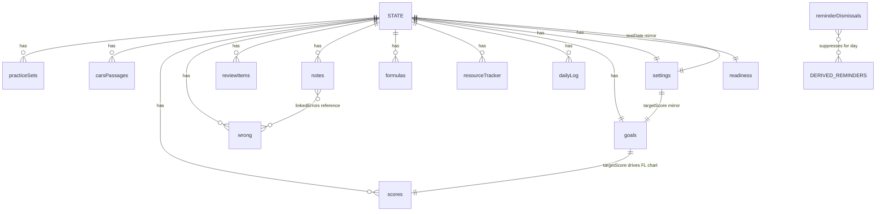

# Design Document — MCAT Command Center Expansion

## Overview

This expansion adds ten new modules and enhances five existing ones in the **MCAT Command Center**, a static, client-side single-page app built with vanilla JavaScript, HTML, and CSS. There is no backend, build system, framework, or package manager. The entire app remains three files — `index.html`, `app.js`, `styles.css` — plus the existing `Resources/` folder.

### Design Goals

1. **Integrate, don't rewrite.** New modules slot into the existing nav → view → render pattern. The existing modules (Dashboard, Calendar, To-Do, Pomodoro, Focus Topics, Wrong Answers, Test Scores, Application, Resources) keep working unchanged except where a requirement explicitly enhances them. (Req 9.5, 20.4)
2. **Preserve data.** All new data lives as additional keys on the single global `state` object, persisted to `localStorage` under the existing key `mcat_command_center_v2`. A one-time, idempotent migration upgrades older saved states by adding missing keys/sub-keys with documented defaults while preserving every existing value. (Req 1, 2)
3. **No new dependencies.** No React/Vue/TypeScript, no bundler, no npm, no chart library, no markdown library. New graphs are hand-drawn SVG (the existing `drawChart()` pattern). Markdown is a small hand-rolled, XSS-safe renderer. (Req 14.8)
4. **Faithful to existing style.** New code reuses the existing helpers (`uid()`, `todayStr()`, `escapeHtml()`, `save()`, `load()`, `addMinutes()`), the existing CSS custom-property theming (`html[data-theme]`), and the same imperative `render*()` function idiom.

### Scope by Requirement

| Area | Requirements | Type |
|---|---|---|
| Persistence & migration | 1 | Enhance Storage_System |
| Backup export/import | 2 | Enhance Backup_System |
| Practice Question Tracker + accuracy graphs | 3, 4 | New |
| Content Review Tracker | 5 | New |
| Error Log enhancements | 6 | Enhance `wrong` |
| Full-Length enhancements | 7 | Enhance `scores` |
| Analytics page | 8 | New |
| Dashboard enhancements | 9 | Enhance |
| CARS Tracker | 10 | New |
| Review / spaced-repetition | 11 | New |
| Resource Tracker enhancements | 12 | Enhance |
| Formula sheet | 13 | New |
| High-Yield Notes | 14 | New |
| Goals & Milestones | 15 | New |
| Daily Study Log | 16 | New |
| Readiness Checklist | 17 | New |
| In-app Reminders | 18 | New |
| Settings / Profile | 19 | New |
| Navigation integration | 20 | Enhance nav |

## Architecture

### Existing Pattern (preserved)

The app is a collection of `<section class="view" id="view-X">` blocks in `index.html`, toggled by sidebar `<button class="nav-btn" data-view="X">` clicks. The nav handler in `app.js` removes `.active` from all nav buttons and views, adds it to the selected pair, and calls a per-view render hook for views that draw charts or aggregated data:

```js
navBtns.forEach(btn => btn.addEventListener("click", () => {
  // toggle active classes ...
  if (btn.dataset.view === "scores") drawChart();
  if (btn.dataset.view === "dashboard") renderHeatmap();
  if (btn.dataset.view === "calendar") renderCalendar();
}));
```

All state is one global object loaded once, mutated in place, and written wholesale by `save()`.

### Integration Approach

**Navigation (Req 20).** Add ten new `.nav-btn` entries and ten new `<section class="view">` blocks. Extend the existing nav click handler so the per-view render dispatch recomputes the selected view's data from `state` *before* it becomes visible. To avoid a growing `if` ladder, introduce a dispatch map:

```js
const VIEW_RENDERERS = {
  dashboard: renderDashboard, calendar: renderCalendar, scores: () => { renderScores(); drawChart(); },
  practice: renderPractice, content: renderContent, cars: renderCars, review: renderReview,
  analytics: renderAnalytics, notes: renderNotes, goals: renderGoals, dailylog: renderDailyLog,
  settings: renderSettings, readiness: renderReadiness
  // existing views without recompute hooks simply have no entry
};
// in nav handler:
(VIEW_RENDERERS[btn.dataset.view] || (() => {}))();
```

This satisfies Req 20.2/20.3 (exactly one active entry/view), 20.5 (recompute before visible), and 20.6/20.7 (each renderer is responsible for showing an empty-state vs. data). Existing views keep their current behavior (Req 20.4).

**Two-layer module structure.** Each module is split so the computation is testable without a DOM:

- **Pure layer** — validation, aggregation, migration, markdown, interval math. Plain functions of `(state-or-data) → value`, no DOM, no `localStorage`. These are the property-tested units.
- **Render/handler layer** — `render*()` functions and form/event handlers that read inputs, call the pure layer, mutate `state`, call `save()`, and write DOM.

To keep everything in one file (no modules) while still being testable, pure helpers are attached to a global namespace object so a test harness can reach them:

```js
const MCAT = {}; // test surface: MCAT.computeGroupAccuracy, MCAT.migrate, MCAT.renderMarkdown, ...
```

In the browser this is just a plain object; under a test runner the same `app.js` (or an extracted `core.js`) exposes `MCAT` for assertions.

### State, Save, and Migration Flow

```
page load
  └─ load()                     // read localStorage, JSON.parse, merge over defaultState (existing)
       └─ migrate(state)        // NEW: add missing keys/sub-keys with defaults, preserve existing
            └─ seed/resets      // existing one-time seeds and recurring resets
                 └─ render*()   // initial paint of all views
user action → mutate state → save() → re-render affected view(s)
```

`load()` keeps its existing shallow merge `{ ...structuredClone(defaultState), ...JSON.parse(raw) }`, which handles top-level missing keys (Req 1.2). The new `migrate()` step handles **nested** defaults (sub-keys) and **per-record field back-fill** (e.g., adding `category`, `explanation` to old `wrong` entries; `percentiles`, `timeTaken` to old `scores` entries) that the shallow merge cannot reach (Req 1.3, 6.3, 7.5). `migrate()` is idempotent: running it on an already-migrated state changes nothing.

### Module / Render-Function Map

| View id | Nav label | State key(s) | Primary render fn | Pure helpers (test surface) |
|---|---|---|---|---|
| `practice` | Practice Questions | `practiceSets` | `renderPractice` | `validatePracticeSet`, `percentCorrect`, `computeGroupAccuracy`, `accuracyByTopic`, `accuracyBySection`, `timedVsUntimed` |
| `content` | Content Tracker | `contentStatuses`, `customContentTopics` | `renderContent` | `statusCounts`, `validateCustomTopic`, `buildSubjectTree` |
| `wrong` (enhanced) | Wrong Answers | `wrong` | `renderWrong` | `categoryCounts`, `isValidISODate` |
| `scores` (enhanced) | Test Scores | `scores` | `renderScores`,`drawChart`,`drawSectionTrends` | `scoreTotal`, `validateSections`, `sectionTrendSeries` |
| `analytics` | Analytics | (derived) | `renderAnalytics` | `weaknessRanking`, `mistakeFrequency`, `weeklyVolume`, `weeklyHours`, `predictedScoreRange` |
| `cars` | CARS Tracker | `carsPassages` | `renderCars` | `validateCarsEntry`, `avgMinutesPerPassage`, `accuracyByQuestionType` |
| `review` | Review | `reviewItems` | `renderReview` | `nextInterval`, `markReviewed`, `markMissed`, `reviewState`, `retentionRate`, `topicsByRetention`, `dueCount` |
| `resources` (enhanced) | Resources | `resourceTracker` (+ existing static links) | `renderResources` | `completionPct`, `validateResourceCounts`, `sortByPriority` |
| `formulas` | Formulas | `formulas` | `renderFormulas` | `searchFormulas`, `filterByTags` |
| `notes` | Notes | `notes` | `renderNotes` | `renderMarkdown`, `searchNotes` |
| `goals` | Goals | `goals` | `renderGoals` | `validateTarget`, `weeklyHourProgress`, `dailyQuestionProgress` |
| `dailylog` | Daily Log | `dailyLog` | `renderDailyLog` | `validateDailyLog`, `upsertDailyLog` |
| `readiness` | Readiness Checklist | `readiness` | `renderReadiness` | `validateChecklistItem`, `completedCount` |
| `settings` | Settings | `settings` | `renderSettings` | `validateTarget`, `isValidFutureDate` |
| (cross-cutting) | reminder bar | `reminderDismissals` | `renderReminders` | `computeReminders`, `isDismissedToday` |

### Reminder Bar (cross-cutting, Req 18)

A single persistent `<div id="reminderBar">` lives in `index.html` above `.main` content (inside `.main`, before the views) so it shows on every view. `renderReminders()` runs on load and after any mutation to test date, review items, events, or error-log retest dates. It calls the pure `computeReminders(state, today)` and filters out reminders dismissed for `today` via `reminderDismissals` (a map of `reminderKey → "YYYY-MM-DD"`). All computation is local; no network calls (Req 18.5).

## Components and Interfaces

This section specifies the pure-layer function contracts. Render/handler functions are described where behavior is non-obvious.

### Storage & Migration

```js
// Adds any missing top-level key and nested sub-key with documented defaults,
// and back-fills per-record fields on existing `wrong` and `scores` entries.
// Idempotent: migrate(migrate(s)) deep-equals migrate(s). Never mutates existing values.
MCAT.migrate(state) -> state

// Deep merge of defaults UNDER existing values (existing wins), used by migrate.
MCAT.applyDefaults(target, defaults) -> target
```

`save()` is wrapped to satisfy Req 1.7 / 1.5:

```js
function save() {
  try { localStorage.setItem(STORE_KEY, JSON.stringify(state)); return true; }
  catch (e) { showSaveError(e); return false; } // in-memory state untouched; user notified
}
```

### Backup (Req 2)

Export already serializes the whole `state` (`JSON.stringify(state, null, 2)`), so new keys are included automatically (Req 2.1). Import is enhanced to:
1. Parse; if parse fails or result is not a plain object → reject, keep state, show error (Req 2.5).
2. Confirm replacement (existing `confirm()`), cancel keeps state (Req 2.6, 2.7).
3. Replace via `state = migrate({ ...structuredClone(defaultState), ...imported })` so a backup missing new keys gets defaults (Req 2.4), then `save()` + reload.

```js
MCAT.parseBackup(text) -> { ok: true, value: object } | { ok: false, reason: string }
```

### Practice Question Tracker (Req 3, 4)

```js
MCAT.validatePracticeSet(input) -> { ok: true, value: PracticeSet } | { ok: false, errors: {field: msg} }
// rules: section ∈ {C/P,CARS,B/B,P/S}; attempted integer 1..9999;
//        correct integer 0..attempted; text fields trimmed/length-capped.

MCAT.percentCorrect(correct, attempted) -> integer 0..100      // round-half-up; attempted>0 guaranteed by validation
MCAT.computeGroupAccuracy(sets) -> number 0..100 (1 dp) | null // null when Σattempted===0 (caller omits group)
MCAT.accuracyByTopic(sets)   -> [{ topic, pct, attempted }]    // omits topics with Σattempted===0
MCAT.accuracyBySection(sets) -> [{ section, pct, attempted }]
MCAT.timedVsUntimed(sets)    -> { timed: pct|null, untimed: pct|null }
MCAT.accuracyOverTime(sets)  -> [{ date, pct }] sorted ascending by date
```

Graphs render with the same SVG approach as `drawChart()`: a shared `svgLine/svgText/svgRect/svgPath` helper set drawn into `<svg>` elements with `document.createElementNS`. Accuracy-over-time is a line chart (y axis fixed 0–100); by-topic, by-section, and timed-vs-untimed are horizontal/vertical bar charts. Empty state replaces each chart with a message (Req 4.7, shown immediately on load).

### Content Review Tracker (Req 5)

```js
MCAT.buildSubjectTree(customContentTopics) -> [{ section, groups: [{ name, topics: [label] }] }]
// predefined tree from blueprint §3, merged with custom topics per section.

MCAT.statusCounts(tree, contentStatuses) -> { "not started": n, "in progress": n, reviewed: n, "needs practice": n, mastered: n }
// every status key present even when 0; topics with no stored status counted as "not started".

MCAT.validateCustomTopic(section, label, tree) -> { ok } | { ok:false, reason }
// reject empty/whitespace-only, >100 chars, or case-insensitive duplicate within the section.
```

`contentStatuses` is keyed by a stable topic key `"{section}::{label}"` so adding/removing custom topics never disturbs predefined statuses.

### Error Log Enhancements (Req 6)

The existing `wrong` array gains fields. `renderWrong()` keeps repeat-detection and open/resolved (Req 6.8) and adds a category `<select>`, explanation/takeaway textareas (maxlength 2000, enforced both in markup and in handler), a needs-review checkbox, and a retest `<input type="date">` that saves on `change` (Req 6.4).

```js
MCAT.categoryCounts(wrong) -> { <each of 9 categories>: n, unset: n } // all keys present, 0 allowed
MCAT.isValidISODate(s) -> boolean // strict YYYY-MM-DD calendar validity (e.g. rejects 2024-02-30)
MCAT.clampText(s, max) -> string  // returns last-valid truncation for length enforcement
```

### Full-Length Tracker Enhancements (Req 7)

```js
MCAT.validateSections({cp,cars,bb,ps}) -> { ok } | { ok:false, invalid: [{section, value}] }
// reports EVERY section outside 118..132 independently (Req 7.8)
MCAT.scoreTotal(record) -> integer 472..528           // existing, reused
MCAT.sectionTrendSeries(scores) -> { cp:[{date,v}], cars:[...], bb:[...], ps:[...] }
// ordered by date; tolerates incomplete/missing new fields (Req 7.7)
```

`drawSectionTrends()` draws four small multiples (one per section) using the SVG helpers; total-score chart (`drawChart`) is preserved and uses `state.goals.targetScore` as the target line (Req 7.6).

### Analytics (Req 8)

```js
MCAT.weeklyBucketKey(dateStr) -> "YYYY-MM-DD"   // Monday of that date's ISO week (Mon–Sun)
MCAT.weeklyVolume(practiceSets) -> [{ weekStart, attempted }] ascending
MCAT.weeklyHours(sessions)      -> [{ weekStart, hours }] ascending
MCAT.weaknessRanking(practiceSets) -> [{ topic, pct, attempted }]
// ascending pct; ties broken by greater attempted first (Req 8.5)
MCAT.mistakeFrequency(wrong) -> [{ category, count }]
// descending count; ties broken alphabetically by category (Req 8.6)
MCAT.predictedScoreRange(scores) -> { low, high } | null
// null when <2 records; else clamp to 472..528 with low<=high (Req 8.9)
```

`predictedScoreRange` uses a simple, explainable model: take recorded `Total_Score`s, compute mean and sample standard deviation, and return `[round(mean − sd), round(mean + sd)]` clamped to 472–528 with `low = min(low, high)`. (Sd-based band over the recorded totals — no external stats lib.)

### CARS Tracker (Req 10)

```js
MCAT.validateCarsEntry(input) -> { ok, value } | { ok:false, errors }
// date is valid calendar date <= today; accuracy number 0..100; time >0 and <=600;
// passages integer 1..99; difficulty ∈ {easy,medium,hard}; questionTypes ⊆ the six types.
MCAT.avgMinutesPerPassage(entries) -> number (1 dp) | null   // null when total passages 0
MCAT.accuracyByQuestionType(entries) -> { <each of 6 types>: pct(1dp) | absent }
// computed only from entries tagged with that type; types with no entries omitted.
```

### Review / Spaced-Repetition Tracker (Req 11)

```js
const REVIEW_INTERVALS = [1, 3, 7, 21]; // days

MCAT.nextInterval(currentInterval) -> next value in [1,3,7,21], capped at 21
MCAT.markReviewed(item, today) -> item   // advance interval, nextDue = today+interval,
                                         // state "reviewed"; "mature" when interval hits 21
MCAT.markMissed(item, today)   -> item   // interval reset to 1, nextDue = today+1, state "missed"
MCAT.reviewState(item, today)  -> "new"|"due"|"reviewed"|"mature"|"missed"
// "new" if never reviewed/missed; "due" while nextDue <= today (overrides reviewed/mature for display)
MCAT.dueCount(items, today) -> integer >= 0      // count with nextDue <= today
MCAT.retentionRate(items) -> integer 0..100 | "N/A"
// "N/A" when (reviewedMarks+missedMarks)===0; else round(reviewed/(reviewed+missed)*100)
MCAT.topicsByRetention(items) -> [{ topic, rate }]  // ascending rate; ties alphabetical by topic
```

Each item tracks cumulative `reviewedMarks` and `missedMarks` counters used by `retentionRate`.

### Resource Tracker Enhancements (Req 12)

```js
MCAT.validateResourceCounts(completed, total) -> { ok } | { ok:false, reason }
// integers >=0; completed <= total
MCAT.completionPct(completed, total) -> string // "x.x%"; "0%" when total===0 (no division)
MCAT.sortByPriority(resources) -> resources    // highest→lowest; throws are surfaced, no fallback (Req 12.8)
```

Existing static resource links (`Resources/…` files) are preserved exactly; the tracker adds an editable list above/below them (Req 12.6).

### Formula Sheet (Req 13)

```js
MCAT.searchFormulas(formulas, term) -> Formula[]      // case-insensitive substring on name|expression|any tag
MCAT.filterByTags(formulas, selectedTags) -> Formula[] // entries with >=1 selected tag
```

Practice-recall is a per-entry UI toggle: hide `.expression`, show a Reveal button that un-hides it (Req 13.7, 13.8). Memorized flag toggles persist via `save()`.

### Notes + Markdown (Req 14)

```js
// XSS-safe, hand-rolled. Order: ESCAPE FIRST (escapeHtml on the whole body),
// THEN apply markdown transforms on the already-escaped text. Because all <,>,&," are
// already entities, any embedded HTML/script renders as inert text (Req 14.8).
MCAT.renderMarkdown(body) -> htmlString
// supports: # h1..### h3, **bold**, *italic*, ordered (1.) & unordered (-,*) lists,
// [text](url) links (href sanitized: only http/https/relative; javascript: neutralized),
// `inline code`.

MCAT.searchNotes(notes, term) -> Note[]   // case-insensitive substring on title|body|any tag
```

Raw markdown is stored verbatim (Req 14.6); rendering is a display-time transform only. Linked error-log navigation checks existence first (Req 14.9).

### Goals (Req 15) & Settings (Req 19)

```js
MCAT.validateTarget(n) -> { ok, value } | { ok:false, reason } // integer 472..528
MCAT.weeklyHourProgress(sessions, goalHours, today) -> { hours, goalHours, pct }   // Mon–Sun current week
MCAT.dailyQuestionProgress(practiceSets, goalQ, today) -> { count, goal, pct }     // today only
MCAT.isValidFutureDate(s, today) -> boolean   // valid calendar date AND not earlier than today (Req 19.7)
```

`goals.targetScore` is the single source of truth for the target used by Dashboard and the full-length chart. Settings writes to the same `goals.targetScore` / `settings.testDate` (mirrored to `state.testDate`) so changes propagate within 1 second via re-render (Req 19.3, 19.4, 15.6).

### Daily Log (Req 16)

```js
MCAT.validateDailyLog(input) -> { ok, value } | { ok:false, errors }
// date valid; hours 0..24 (<=1 dp); questions int 0..9999; accuracy 0..100;
// energy int 1..5; confidence int 1..5; reflection <=2000.
MCAT.upsertDailyLog(log, entry) -> log   // replace existing entry for same date, else append (Req 16.2)
```

### Readiness Checklist (Req 17)

```js
MCAT.validateChecklistItem(label, customCount) -> { ok } | { ok:false, reason }
// reject zero-length; reject >100 chars; reject when customCount>=50.
// NOTE: whitespace-only labels are ALLOWED (Req 17.4 explicitly permits them).
MCAT.completedCount(readiness) -> integer   // checked predefined + custom items
```

## Data Models

All new data are keys added to the single `state` object persisted under `localStorage["mcat_command_center_v2"]`. The expansion **adds** keys to `defaultState`; no existing key is removed or renamed. Top-level missing keys are filled by `load()`'s shallow merge, while nested sub-keys and per-record fields are deep-initialized by `migrate()` on load (Req 1.2, 1.3).

### Extended `defaultState`

```js
const defaultState = {
  // ---- existing keys (unchanged) ----
  testDate: "", target: 510, tasks: [], topics: [],
  scores: [{ id: 1, date: "", name: "BP FL1", cp: 119, cars: 124, bb: 124, ps: 124 }],
  appItems: [], wrong: [], events: [], sessions: {},
  pomo: { work: 40, break: 10, long: 20, rounds: 4 },
  theme: "dark", seeded: false,
  lastDailyReset: "", lastWeeklyReset: "", lastMonthlyReset: "",

  // ---- NEW keys ----
  schemaVersion: 2,                 // bumped from implicit v1; migrate() reads/sets this
  practiceSets: [],                 // PracticeSet[]
  contentStatuses: {},              // { "section::label": status }   (absence = "not started")
  customContentTopics: [],          // [{ section, label }]
  carsPassages: [],                 // CarsPassageEntry[]
  reviewItems: [],                  // ReviewItem[]
  resourceTracker: [],              // ResourceEntry[]
  formulas: [],                     // FormulaEntry[]  (seeded once from blueprint §11)
  notes: [],                        // NoteEntry[]
  goals: {                          // Goals_Module
    targetScore: 510,               // mirrors legacy `target` on migration; source of truth going forward
    weeklyHourGoal: 0,
    dailyQuestionGoal: 0,
    milestones: []                  // [{ id, text, done }]
  },
  dailyLog: [],                     // DailyLogEntry[] (one per date)
  readiness: {                      // Readiness_Checklist
    predefined: [ /* 10 items, see below */ ],   // [{ key, label, checked }]
    custom: []                                    // [{ id, label, checked }]
  },
  reminderDismissals: {},           // { reminderKey: "YYYY-MM-DD" }
  settings: {                       // Settings_Module / profile
    name: "", testDate: "", targetScore: 510, diagnosticScore: null,
    weeklyAvailability: 0, preferredResources: "", studyPhase: "content review"
  }
};
```

### Record Shapes

**PracticeSet** (Req 3.2)
```js
{ id, date: "YYYY-MM-DD", resource: "" /*<=100*/, section: "C/P"|"CARS"|"B/B"|"P/S",
  topic: "" /*<=100*/, correct: int>=0, attempted: int 1..9999,
  timing: "timed"|"untimed", difficulty: "easy"|"medium"|"hard", notes: "" /*<=500*/ }
// percentCorrect is derived (computed on demand via percentCorrect(correct, attempted)), not stored,
// so it can never drift from its inputs (Req 3.3).
```

**Content status value** (Req 5.2): `contentStatuses[topicKey] = status` where `topicKey = "{section}::{label}"` and `status` is one of `"not started" | "in progress" | "reviewed" | "needs practice" | "mastered"`. Default for any unkeyed topic = `"not started"` (Req 5.4). Custom topics live in `customContentTopics[]` as `{ section, label }`, so adding/removing them never disturbs predefined statuses.

**Enhanced `wrong` entry** (Req 6) — existing fields plus new, defaults applied by migration:
```js
{ id, date, source, topic, section, why, count, status,   // existing
  category: "unset",        // "unset" | one of 9 Mistake_Categories
  explanation: "",          // 0..2000
  takeaway: "",             // 0..2000
  needsReview: false,
  retestDate: "" }          // "" or valid ISO date
```

**Enhanced `scores` / Full_Length_Record** (Req 7) — existing fields plus new, defaults applied by migration:
```js
{ id, date, name, cp, cars, bb, ps,                       // existing (name == exam source; sections 118..132)
  percentiles: { cp: null, cars: null, bb: null, ps: null, total: null }, // each null or int 0..100
  timeTaken: null,          // null or int 1..1440 (minutes)
  conditions: { timed:false, singleSitting:false, withBreaks:false, realConditions:false },
  reviewStatus: "not reviewed",  // "not reviewed" | "reviewed"
  lessons: "" }             // 0..2000
// total is computed via scoreTotal(record); range 472..528 follows from each section ∈ 118..132 (Req 7.2).
```

**CarsPassageEntry** (Req 10.2)
```js
{ id, date /*"YYYY-MM-DD" <= today*/, passages: int 1..99, accuracy: 0..100,
  timePerPassage: >0 /*minutes, <=600*/,
  difficulty: "easy"|"medium"|"hard",
  questionTypes: ["main idea"|"author's tone"|"inference"|"function"|"detail"|"new information/application"...],
  notes: "" /*<=2000*/ }
```

**ReviewItem** (Req 11.1)
```js
{ id, topic: "" /*1..100*/, content: "" /*1..2000*/,
  state: "new"|"due"|"reviewed"|"mature"|"missed",
  intervalIndex: 0,         // index into [1,3,7,21]; -1 = never advanced (new)
  nextDue: "",              // "YYYY-MM-DD"
  reviewedMarks: 0, missedMarks: 0 }
// state (new/due/reviewed/mature/missed) is derived by reviewState(item, today), not stored,
// so it always reflects the current date (Req 11.2, 11.3).
```

**ResourceEntry** (Req 12.1)
```js
{ id, name: "" /*1..200*/, type: "", totalQuestions: int 0..999999,
  questionsCompleted: int 0..999999, accuracy: 0..100,
  priority: "high"|"med"|"low", notes: "" /*<=2000*/ }
```

**FormulaEntry** (Req 13.1)
```js
{ id, name: "" /*1..100*/, expression: "" /*1..500*/, tags: ["" /*1..50 each*/], memorized: false }
```

**NoteEntry** (Req 14.1)
```js
{ id, title: "" /*1..200*/, body: "" /*0..50000, raw markdown verbatim*/,
  tags: ["" /*<=20 tags, 1..50 each*/], needsReview: false,
  linkedErrors: [errorId, ...] }   // ids into state.wrong
```

**Milestone** (Req 15.1): `{ id, text, done: false }`, up to 100.

**DailyLogEntry** (Req 16.1)
```js
{ date: "YYYY-MM-DD" /*unique key*/, hours: 0..24 /*<=1 dp*/, questions: int 0..9999, accuracy: 0..100,
  subject: "", energy: int 1..5, confidence: int 1..5, reflection: "" /*<=2000*/ }
```

**Readiness predefined items** (Req 17.1) — fixed 10, default `checked:false`:
`test location confirmed, valid ID ready, AAMC login ready, snacks packed, break plan made, sleep schedule adjusted, last full-length completed, formulas reviewed, weak topics reviewed, no heavy studying day before`. The `custom` array holds `{ id, label /*1..100*/, checked }` up to 50 items (Req 17.4).

### State Relationships



### Derived (computed, never stored) values

These are recomputed on each render to guarantee they cannot drift from their sources: practice percent-correct, all aggregate accuracies, full-length totals, review item state/due counts, retention rate, predicted score range, reminders, and all analytics metrics. Storing only the raw inputs and deriving everything else is what makes the round-trip (Req 2.3) and migration-idempotence (Req 1) properties hold cleanly.

### Migration Function (Req 1, 6.3, 7.5)

```js
function migrate(state) {
  // 1. Top-level: add any missing NEW key with its default (deep-cloned).
  for (const k of Object.keys(defaultState))
    if (!(k in state)) state[k] = structuredClone(defaultState[k]);

  // 2. Nested objects: add missing sub-keys without touching present ones.
  state.goals    = applyDefaults(state.goals,    defaultState.goals);
  state.settings = applyDefaults(state.settings, defaultState.settings);
  state.readiness = mergeReadiness(state.readiness, defaultState.readiness); // keep checked states, add missing predefined

  // 3. Per-record back-fill on existing arrays (preserve existing values).
  state.wrong.forEach(w => applyDefaults(w, { category:"unset", explanation:"", takeaway:"", needsReview:false, retestDate:"" }));
  state.scores.forEach(s => applyDefaults(s, {
    percentiles:{cp:null,cars:null,bb:null,ps:null,total:null}, timeTaken:null,
    conditions:{timed:false,singleSitting:false,withBreaks:false,realConditions:false},
    reviewStatus:"not reviewed", lessons:"" }));

  // 4. One-time legacy bridge: copy legacy `target` into goals.targetScore if goals was just created.
  if (state.goals.targetScore == null) state.goals.targetScore = state.target ?? 510;

  state.schemaVersion = defaultState.schemaVersion;
  return state;
}
// applyDefaults adds keys from `defaults` that are absent in `target`; existing values win. Idempotent.
```

`migrate()` is **idempotent** (re-running adds nothing new) and **default-merge correct** (present values are never overwritten), which are the properties verified for Req 1.

## Correctness Properties

*A property is a characteristic or behavior that should hold true across all valid executions of a system — essentially, a formal statement about what the system should do. Properties serve as the bridge between human-readable specifications and machine-verifiable correctness guarantees.*

These properties were derived from the acceptance-criteria prework. Redundant criteria were consolidated (for example, the many "Σcorrect/Σattempted" aggregation criteria collapse into one general aggregation property; the migration/default-merge criteria collapse into one migration property; the export/import criteria collapse into one round-trip property). Each property is universally quantified and intended for property-based testing against the pure-layer helpers.

### Property 1: State migration is idempotent and default-preserving

*For any* stored State_Object (including older states missing arbitrary new top-level keys, missing nested sub-keys in `goals`/`settings`/`readiness`, and `wrong`/`scores` records missing the enhanced fields), applying `migrate` (a) adds every missing key/sub-key/record-field with exactly its documented default, (b) leaves every already-present key, sub-key, and value deeply unchanged, and (c) is idempotent: `migrate(migrate(s))` is deeply equal to `migrate(s)`.

**Validates: Requirements 1.2, 1.3, 1.4, 2.4, 6.3, 7.5**

### Property 2: Backup export/import round-trip

*For any* valid State_Object, serializing it to JSON and then parsing-and-migrating that JSON produces a State_Object deeply equal to the original (no key added, removed, or changed in value).

**Validates: Requirements 2.1, 2.2, 2.3**

### Property 3: Corrupt or non-object input is rejected safely

*For any* string that is not valid JSON, or any JSON value that is not a plain object (number, array, string, null, boolean), `load`/`parseBackup` returns the documented default (or a rejection) without throwing and without mutating the current in-memory State_Object.

**Validates: Requirements 1.6, 2.5**

### Property 4: Percent-correct computation is bounded and correct

*For any* integers `correct` and `attempted` with `1 ≤ attempted ≤ 9999` and `0 ≤ correct ≤ attempted`, `percentCorrect(correct, attempted)` is an integer in `[0, 100]` equal to `round(correct / attempted * 100)`.

**Validates: Requirements 3.3**

### Property 5: PracticeSet validation accepts exactly valid inputs

*For any* candidate PracticeSet, `validatePracticeSet` accepts it if and only if its section is one of {C/P, CARS, B/B, P/S}, `attempted` is an integer in `[1, 9999]`, and `correct` is an integer in `[0, attempted]`; rejected inputs are never stored and produce a field-specific error.

**Validates: Requirements 3.1, 3.4, 3.5, 3.6**

### Property 6: Group accuracy is bounded and omits empty groups

*For any* collection of records grouped by any key (topic, section, timed/untimed, or all records), `computeGroupAccuracy` returns `null` when the group's sum of attempted is zero (no division performed and the group is omitted from output), and otherwise returns a number in `[0, 100]` equal to `Σcorrect / Σattempted * 100` rounded to the configured precision (one decimal for graphs, whole number for analytics/dashboard).

**Validates: Requirements 4.5, 4.6, 8.1, 8.2, 9.1, 10.3, 10.4**

### Property 7: Grouped accuracy emits one value per distinct non-empty key

*For any* collection of PracticeSets, the by-topic, by-section, and timed-vs-untimed aggregations emit exactly one value per distinct key that has a positive sum of attempted, and no value for keys absent from the data or with zero attempted.

**Validates: Requirements 4.2, 4.3, 4.4**

### Property 8: Accuracy-over-time is chronological and bounded

*For any* collection of PracticeSets, `accuracyOverTime` returns one point per set, ordered non-decreasing by date, with every point value an integer in `[0, 100]`.

**Validates: Requirements 4.1, 3.8**

### Property 9: Content status counts are total-preserving and complete

*For any* subject tree and any `contentStatuses` map, `statusCounts` returns all five status keys (including zeros), every topic without a stored status is counted as "not started", and the five counts sum to the total number of topics in the tree.

**Validates: Requirements 5.2, 5.4, 5.5**

### Property 10: Custom content topic validation

*For any* section and candidate label, `validateCustomTopic` accepts it if and only if it has 1–100 non-whitespace characters and does not case-insensitively duplicate an existing topic in that section; accepted topics are stored with default status "not started" and rejected ones leave state unchanged.

**Validates: Requirements 5.6, 5.7**

### Property 11: ISO date validation is exact

*For any* string, `isValidISODate` returns true if and only if the string is a real `YYYY-MM-DD` calendar date (rejecting impossible dates such as `2024-02-30`); on rejection the previously stored retest date is retained.

**Validates: Requirements 6.5**

### Property 12: Mistake-category counts are complete and total-preserving

*For any* `wrong` array, `categoryCounts` returns all nine category keys plus an `unset` key (zeros included), and the counts sum to the number of entries.

**Validates: Requirements 6.1, 6.7**

### Property 13: Total score equals the sum of sections and stays in range

*For any* four Section_Scores each an integer in `[118, 132]`, `scoreTotal` equals their arithmetic sum and that sum is an integer in `[472, 528]`.

**Validates: Requirements 7.2**

### Property 14: Section validation reports every invalid section independently

*For any* four candidate section values, `validateSections` rejects the record if and only if at least one value is outside `[118, 132]`, and the reported invalid set is exactly those sections whose value lies outside `[118, 132]` — independent of whether other sections are valid.

**Validates: Requirements 7.8**

### Property 15: Per-section trend is ordered and tolerant of incomplete data

*For any* collection of Full_Length_Records (including records missing the enhanced fields), each of the four section trend series is ordered non-decreasing by date taken and is produced without error.

**Validates: Requirements 7.7**

### Property 16: Weekly bucketing is total-preserving and Monday-aligned

*For any* collection of dated PracticeSets (and, separately, study sessions), `weeklyVolume` (`weeklyHours`) assigns each item to the bucket whose key is the Monday of that item's Monday–Sunday week, and the sum of all bucket values equals the total attempted (total hours) across all items.

**Validates: Requirements 8.3, 8.4**

### Property 17: Weakness ranking ordering with tie-break

*For any* collection of PracticeSets, `weaknessRanking` returns topics ordered by ascending computed accuracy, and among topics with equal accuracy, by greater total attempted first.

**Validates: Requirements 8.5**

### Property 18: Mistake-frequency ordering with tie-break

*For any* `wrong` array, `mistakeFrequency` returns categories ordered by descending count, and among categories with equal count, alphabetically by category name.

**Validates: Requirements 8.6**

### Property 19: Full-length totals are chronological

*For any* collection of Full_Length_Records, the analytics total-score series is ordered non-decreasing by date taken.

**Validates: Requirements 8.7**

### Property 20: Predicted score range is bounded and well-ordered

*For any* collection of two or more Full_Length_Records, `predictedScoreRange` returns a lower and upper bound that are each integers in `[472, 528]` with `low ≤ high`; for fewer than two records it returns `null`.

**Validates: Requirements 8.9**

### Property 21: Dashboard weakness preview is a bounded prefix of the ranking

*For any* collection of PracticeSets, the dashboard's lowest-accuracy topics list has length `min(3, number of distinct ranked topics)` and equals the first elements of `weaknessRanking`.

**Validates: Requirements 9.2**

### Property 22: Goal progress percentages are correct

*For any* study sessions with a weekly hour goal greater than zero, weekly-hour progress percent equals `round(currentWeekHours / goal * 100)`; *for any* PracticeSets with a daily question goal greater than zero, daily progress count equals the sum of today's attempted questions.

**Validates: Requirements 9.4, 15.2, 15.3**

### Property 23: CARS entry validation accepts exactly valid inputs

*For any* candidate CARS_Passage_Entry, `validateCarsEntry` accepts it if and only if its date is a valid calendar date not after today, accuracy is a number in `[0, 100]`, time taken is a number in `(0, 600]`, passages is an integer in `[1, 99]`, and difficulty/question-types are within their allowed sets; rejected entries leave state unchanged.

**Validates: Requirements 10.1, 10.5, 10.6**

### Property 24: Spaced-repetition interval progression

*For any* Review_Item, repeatedly marking it reviewed advances its interval through the sequence 1 → 3 → 7 → 21 days and then stays capped at 21; after each reviewed mark `nextDue` equals the current date plus the new interval, the state is "reviewed", and the state becomes "mature" exactly when the interval reaches 21.

**Validates: Requirements 11.4, 11.5**

### Property 25: Marking missed resets the interval

*For any* Review_Item, marking it missed sets its interval to 1 day, sets `nextDue` to the current date plus 1 day, and sets its state to "missed".

**Validates: Requirements 11.6**

### Property 26: Review state classification and due count

*For any* Review_Item, `reviewState` returns "new" exactly when it has never been reviewed or missed, and classifies it as "due" whenever its `nextDue` is on or before the current date; `dueCount` equals the number of items whose `nextDue` is on or before the current date.

**Validates: Requirements 11.2, 11.3, 11.7, 9.3**

### Property 27: Retention rate handles the zero denominator

*For any* collection of Review_Items, `retentionRate` returns "N/A" (with no division performed) when the combined number of reviewed and missed marks is zero, and otherwise returns an integer in `[0, 100]` equal to `round(reviewedMarks / (reviewedMarks + missedMarks) * 100)`.

**Validates: Requirements 11.8, 11.9**

### Property 28: Topics ordered by ascending retention with tie-break

*For any* collection of Review_Items, `topicsByRetention` orders topics by ascending retention rate, and among equal rates, alphabetically by topic label.

**Validates: Requirements 11.10**

### Property 29: Resource completion percentage handles the zero denominator

*For any* non-negative integers `completed ≤ total`, `completionPct` returns `"0%"` (no division performed) when `total` is zero, and otherwise returns `completed / total * 100` rounded to one decimal place followed by `"%"`, with the numeric value in `[0, 100]`.

**Validates: Requirements 12.2, 12.3**

### Property 30: Resource count validation

*For any* candidate `completed`/`total` pair, `validateResourceCounts` accepts it if and only if both are integers greater than or equal to zero and `completed ≤ total`; rejected input retains the previously stored values.

**Validates: Requirements 12.4, 12.5**

### Property 31: Priority sort ordering

*For any* collection of ResourceEntries, `sortByPriority` returns them ordered from highest to lowest priority level.

**Validates: Requirements 12.7**

### Property 32: Formula and note search is a correct case-insensitive substring filter

*For any* collection of Formula_Entries (or Note_Entries) and any non-empty search term, the result contains exactly those entries for which the term appears as a case-insensitive substring of the name/title, expression/body, or any tag; clearing the term returns all entries (or, for formulas, all entries satisfying the active tag filter).

**Validates: Requirements 13.2, 13.4, 14.3**

### Property 33: Tag filter returns entries with at least one selected tag

*For any* collection of Formula_Entries and any non-empty set of selected tags, the filtered result contains exactly those entries that include at least one selected tag.

**Validates: Requirements 13.9**

### Property 34: Markdown body is preserved verbatim

*For any* string, storing it as a Note_Entry body and later reading the stored body returns a string equal to the input character for character; rendering never mutates the stored body.

**Validates: Requirements 14.6**

### Property 35: Markdown rendering is XSS-safe

*For any* note body string (including embedded `<script>`, event-handler attributes, and raw HTML tags), `renderMarkdown` produces output in which all such content appears as inert escaped text — the output contains no live script element and no un-escaped author-supplied angle brackets, and any `javascript:` link target is neutralized.

**Validates: Requirements 14.8**

### Property 36: Target-score validation is exact

*For any* value, `validateTarget` accepts it if and only if it is an integer in `[472, 528]`; on rejection the previously stored target (or diagnostic) value is retained, and on acceptance the value is stored without error.

**Validates: Requirements 15.7, 19.6**

### Property 37: Future-date validation for settings test date

*For any* string, `isValidFutureDate` returns true if and only if it is a valid calendar date that is not earlier than the current date; on rejection the previously stored test date is retained.

**Validates: Requirements 19.7**

### Property 38: Daily-log upsert keeps at most one entry per date

*For any* sequence of valid Daily_Log_Entry submissions, the resulting log contains at most one entry per date, and the entry for a given date equals the most recently submitted entry for that date.

**Validates: Requirements 16.2**

### Property 39: Daily-log entries are ordered most-recent-first

*For any* collection of Daily_Log_Entries, the displayed order is non-increasing by date.

**Validates: Requirements 16.5**

### Property 40: Daily-log validation

*For any* candidate Daily_Log_Entry, `validateDailyLog` accepts it if and only if the date is valid and every numeric field is within its allowed range (hours 0–24 with ≤1 decimal, questions 0–9999, accuracy 0–100, energy 1–5, confidence 1–5); rejected input retains any existing entry for that date.

**Validates: Requirements 16.3**

### Property 41: Readiness completed count

*For any* readiness checklist (predefined plus custom), `completedCount` equals the number of checked items and is within `[0, total]`.

**Validates: Requirements 17.3**

### Property 42: Custom checklist item validation (whitespace allowed)

*For any* candidate label, `validateChecklistItem` accepts it if and only if it has 1–100 characters (whitespace-only labels are allowed) and the custom-item count is below 50; rejected additions leave the checklist unchanged.

**Validates: Requirements 17.4, 17.5**

### Property 43: Reminder computation matches qualifying data

*For any* State_Object and current date, `computeReminders` returns exactly the set of reminders implied by the data: the test-date countdown (when a test date is set), each Review_Item due on or before today, each scheduled full-length event dated today, and each Error_Log entry with a retest date on or before today.

**Validates: Requirements 18.1**

### Property 44: Reminder dismissal is scoped to the calendar day

*For any* reminder and any dismissal recorded for a given day, the reminder is excluded from display on that day (including across reloads) and is included again on any later day while it remains active.

**Validates: Requirements 18.4**

### Property 45: Navigation maintains exactly one active entry and one visible view

*For any* selectable view (new or pre-existing), after selecting it exactly one nav entry carries the active marker and exactly one view is visible; all others are inactive and hidden.

**Validates: Requirements 20.2, 20.3, 20.4**

## Error Handling

The app has no backend, so all error handling is local and must never leave the UI in a broken or data-losing state. The strategy follows the existing convention (inline validation, `alert()`/visible messages, no thrown exceptions reaching the user) while tightening it for the new persistence guarantees, using a consistent "validate → reject-or-store → notify" pattern in the handler layer with the pure layer returning structured results rather than throwing.

### Storage errors

- **Parse failure on load (R1.6):** `load()` wraps `JSON.parse` in `try/catch`. On failure it returns a deep clone of `defaultState`, sets an internal `__loadFailed` flag, and does **not** overwrite the stored value — the unparseable string remains in `localStorage` until the next successful `save()`. No exception propagates; the app boots on defaults.
- **Write failure on save (R1.7):** `save()` wraps `setItem` in `try/catch`. On failure (quota exceeded, access denied, private-mode restrictions) the in-memory `state` is left unchanged and a persistent, non-blocking error indicator is shown (a small banner reading e.g. "Couldn't save — storage may be full or blocked"). The two responses (retain memory state, surface error) are independent and both always run; neither is prioritized.

### Input validation (reject-and-retain pattern)

Every module that accepts numeric or constrained input uses a pure `validateX` function returning `{ok:true, value}` or `{ok:false, error}`. On `{ok:false}` the view:
1. does **not** mutate `state` and does **not** call `save()`,
2. retains the previously stored value (for edits) or leaves the form for correction (for new entries),
3. shows a specific, human-readable message naming the offending field and its valid range (inline message near the field, falling back to the existing `alert()` idiom used elsewhere in the app).

This pattern backs Practice (R3.4–R3.6), Content custom topics (R5.7), retest dates (R6.5), section scores (R7.8), CARS (R10.5–R10.6), resources (R12.4–R12.5), goals/settings targets (R15.7, R19.6), test date (R19.7), daily log (R16.3), and checklist items (R17.5). "Independent" validations (R7.8 reporting **every** invalid section, not just the first; R19.4/R19.6 applying valid fields even when another field is invalid) are implemented by collecting all field errors first, applying all valid fields, and reporting the full error set — never aborting on the first error.

### Length-capped text inputs

Length-capped text fields — explanation/takeaway (≤2000, R6.6), notes (≤500 / ≤2000), lessons (≤2000), note body (≤50000) — enforce the cap both via the `maxlength` attribute and via `clampText` in the handler so the last valid value is retained when the limit is reached. Caps are also re-checked in the validator so a programmatic/imported over-length value is normalized rather than crashing a render.

### Missing/legacy data at render time

Enhanced modules read potentially-absent fields defensively: Error Log shows category "unset" for old entries (R6.3); Full-Length shows new fields as unset for old records (R7.5); Content shows "not started" for unstored topics (R5.4). These are handled by the pure accessors (content-status lookup defaulting to "not started", `categoryCounts`) and null-coalescing reads, never by assuming a field exists.

### Empty states

Every chart/aggregate view branches to an empty-state message when its source data is absent, computed independently per metric so a missing metric never blanks a populated one (R4.7, R7.9, R8.8, R9.6, R10.7, R13.3, R14.7, R16.6, R20.6). Empty-state rendering performs no state mutation (R20.6).

### Broken cross-references

A note linked to an error-log entry that no longer exists shows "linked entry unavailable" and suppresses navigation rather than throwing (R14.9).

### Sort/operation failures and partial updates

Priority sort (R12.8) wraps the comparison in `try/catch`; on failure it surfaces an error and leaves the current view unchanged with no fallback reordering. Settings target propagation (R19.4) wraps each dependent re-render independently so a failure updating one consumer (Goals or the Full-Length chart) does not prevent the target value itself from being stored or the other consumer from updating.

### Import safety

Import (R2.5) parses inside `try/catch`; if parsing fails or the result is not a plain object, the import is rejected, the current `state` is retained, and an error message is shown. A valid parse triggers a confirmation prompt (R2.6); cancelling retains the current state (R2.7). On confirm, the imported object is passed through `migrate()` so missing new-module keys are defaulted (R2.4) while present keys are preserved.

### Markdown safety

`renderMarkdown` escapes the entire input first (reusing `escapeHtml`), then applies formatting transforms only to the already-escaped text, and sanitizes link targets (allow only `http:`, `https:`, and relative URLs; neutralize `javascript:`/`data:`). Because all `<`, `>`, `&`, `"` are already entities before any transform runs, embedded HTML/script renders as inert text (R14.8) with no execution path.

## Testing Strategy

This feature is rich in pure, input-varying logic (validation, aggregation, migration, serialization round-trips, interval math, markdown), so it is a strong fit for property-based testing alongside targeted unit tests.

### Constraints and approach

The project has **no build system, no package.json, and no test runner** by design. To make the correctness properties executable without changing the app's shipping shape (still three static, dependency-free files), the testing approach separates *pure logic* from *DOM wiring*:

1. **Extract pure functions** (`migrate`, `applyDefaults`, `percentCorrect`, `computeGroupAccuracy`, `accuracyOverTime`, `scoreTotal`, `validateSections`, `sectionTrendSeries`, `nextInterval`, `markReviewed`, `markMissed`, `reviewState`, `retentionRate`, `predictedScoreRange`, `completionPct`, `renderMarkdown`, `searchFormulas`, `upsertDailyLog`, all `validateX`, ranking/series builders, `computeReminders`, `isDismissedToday`) so they take inputs and return outputs with **no DOM access and no `localStorage` access**. They are attached to the `MCAT` namespace described in the architecture, which doubles as the test surface.
2. **Dual-environment export shim** so the same source runs in the browser and is importable by Node. Recommended: move the pure layer into a small `core.js` (included before `app.js` in `index.html`) to keep the boundary explicit and avoid coupling tests to DOM code. The browser loads `core.js` then `app.js`; Node tests `require("./core.js")`. A shim at the bottom keeps a single source of truth:

   ```js
   if (typeof module !== "undefined" && module.exports) {
     module.exports = { migrate, applyDefaults, percentCorrect, computeGroupAccuracy,
       scoreTotal, validateSections, nextInterval, markReviewed, markMissed, reviewState,
       retentionRate, predictedScoreRange, completionPct, renderMarkdown, searchFormulas,
       upsertDailyLog, validatePracticeSet, /* ...all pure fns */ };
   }
   ```

   The shipped app still loads everything via `<script>` tags; the static three-file artifact remains dependency-free.
3. **Test harness — lightweight, dev-only, not shipped.** A dev-only `package.json` may be added **outside the deployed artifact** (e.g., in a `tests/` folder) solely to run the chosen library locally. Tests require the extracted pure module and never touch the DOM. DOM-coupled behavior (navigation toggling, empty-state rendering, persistence on change) that cannot be made pure is verified with a small set of example/integration tests using a lightweight DOM (`jsdom`, dev-only) — kept to 1–3 representative cases each, since these are not input-varying properties.

### Property-based tests

- **Library:** [`fast-check`](https://github.com/dubzzz/fast-check) with Node's built-in `node:test` runner (Node ≥18, zero extra runtime deps in the app). We **do not** implement a property-testing engine from scratch — fast-check is the chosen library and provides the generators (`fc.integer`, `fc.string`, `fc.record`, `fc.array`, plus custom arbitraries).
- **Coverage:** one property-based test per Correctness Property (Properties 1–45).
- **Iterations:** each property test runs a minimum of **100** generated cases (`fc.assert(fc.property(...), { numRuns: 100 })` or higher for cheap pure functions).
- **Tagging:** each property test is tagged with a comment referencing its design property, using the format:
  `// Feature: mcat-tracker-expansion, Property {number}: {property_text}`
  for example: `// Feature: mcat-tracker-expansion, Property 6: Group accuracy is bounded and omits empty groups`
- **Custom arbitraries:**
  - `arbPracticeSet` — valid section/timing/difficulty, `attempted` 1..9999, `correct` 0..attempted.
  - `arbInvalidPracticeSet` — deliberately violates one constraint (for Property 5).
  - `arbFullLength` — sections 118..132, optionally incomplete (for Properties 13, 14, 15).
  - `arbReviewItem` — interval in {1,3,7,21}, arbitrary `nextDue` and mark histories.
  - `arbState` — composes module arbitraries into whole-state objects (for Properties 1–3).
  - `arbMarkdown` and `arbHostileMarkdown` — the latter injects `<script>`, `onerror=`, `javascript:` payloads (for Property 35).
  - `arbDailyLog`, `arbCarsEntry`, and arbitrary date strings for ISO/future-date validation.

### Unit / example tests (complementary)

Targeted example-based tests cover specific scenarios, edge cases, and integration points that are not universal properties:
- Storage error paths: corrupt `localStorage` → defaults, no throw (R1.6); `setItem` throwing → state retained + error surfaced (R1.5, R1.7).
- Import rejection on non-JSON / non-object (R2.5); confirm/cancel branches (R2.6/R2.7).
- Delete operations (R3.7), status-change persistence (R5.3), repeat-detection/open-resolved preservation (R6.8).
- Validation edge boundaries (EDGE_CASE-classified criteria): `correct = attempted` boundary, `attempted = 1` and `9999`, accuracy `0` and `100`, time just above 600, `total = 0` completion, leap-year date `2024-02-29` valid vs `2023-02-29` invalid, oversized text, duplicate/whitespace topic labels, zero review-mark denominators.
- Propagation examples: settings test date → countdown (R19.3), target → goals/chart with partial-update tolerance (R19.4), and toggle persistence (memorized flag, milestone done, checklist checked, needs-review) (R13.5, R13.6, R14.5, R15.5, R17.2).
- Markdown subset rendering of each supported construct — headings, bold, italic, ordered/unordered lists, links, inline code (R14.2) — plus targeted XSS examples that complement the Property 35 generator.
- Empty-state rendering for each view (R4.7, R7.9, R8.8, R10.7, R16.6, R20.6) and navigation structure (R20.1, R20.5, R20.7) via `jsdom`.
- Legacy-data display: an old `scores`/`wrong` record renders new fields as "unset".

### What is intentionally NOT property-tested

Per the prework classification, these are covered by example/smoke/integration tests rather than PBT because behavior does not vary meaningfully with input or concerns wiring/UI:
- Structural/setup items (subject tree present, 10 readiness items present, nav entries added): SMOKE (R5.1, R17.1, R20.1).
- "Zero network requests" (R18.5): verified by code review / a no-`fetch`/`XMLHttpRequest` assertion, not PBT.
- Timing/refresh "within 1 second" (R5.3, R10.1, R19.3, R19.4): not unit-measurable as a property; verified by example.
- Toggle persistence (memorized flag, milestone done, checklist checked): EXAMPLE.
- UI affordances (practice-recall reveal, reflection prompts, panel preservation): EXAMPLE/regression.

### Test execution

Because watch modes block, tests run as single-shot commands the developer invokes manually, e.g. `node --test tests/` (Node ≥18). No watcher is configured. A short `tests/README.md` documents the one-line command and the Node version requirement.
